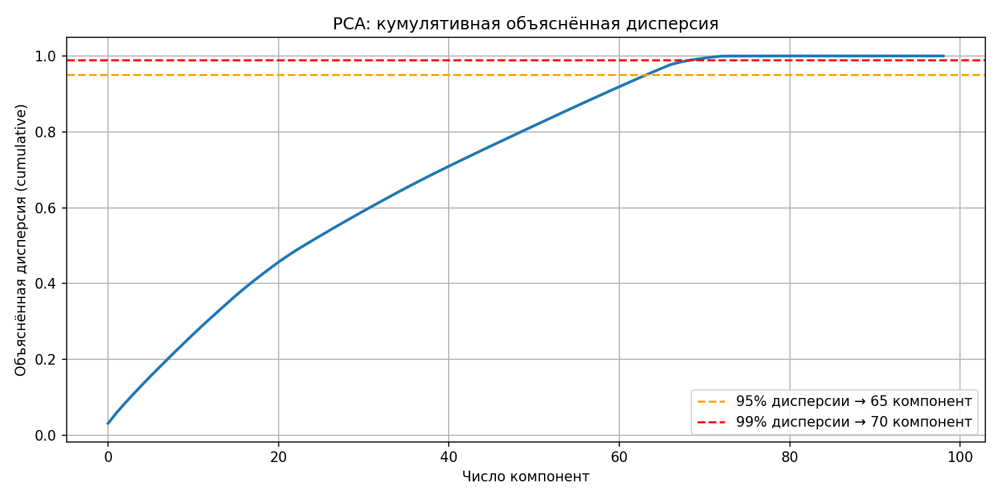
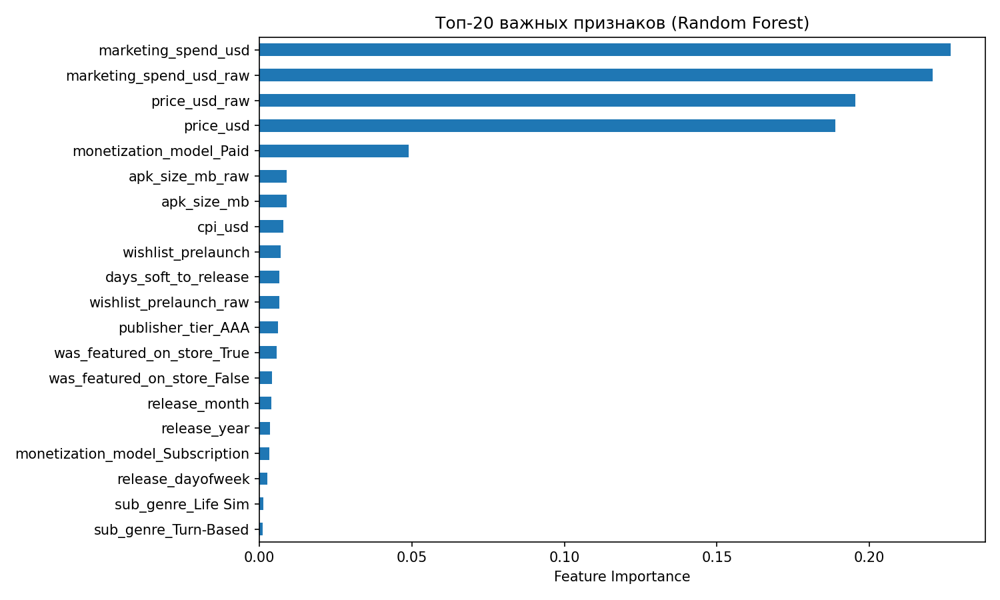
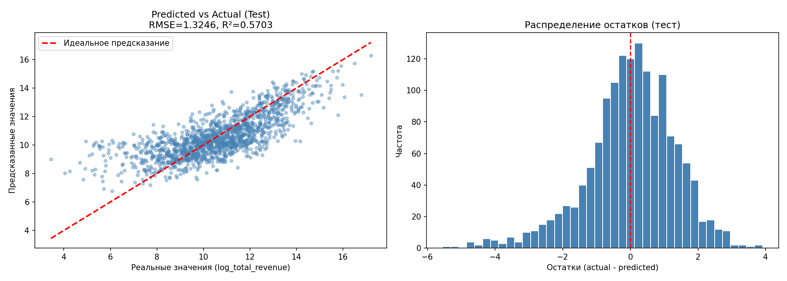

# Отчёт по проекту

**Студент:** Чашкин Фёдор Борисович
**Группа:** БИВ231

---

## 1. Введение и постановка задачи

- **Цель проекта:** предсказание общего дохода (`total_revenue_usd`) мобильной игры на основе информации, доступной до её релиза. Это может помочь издателям оценить коммерческий потенциала, например, чтобы лучше распределять деньги на маркетинг.
- **Формулировка задачи:** регрессия.
- **Обоснование метрики качества:**
  * RMSE выбрана основной метрикой, поскольку она чувствительна к большим ошибкам. Мы прогнозируем доход, поэтому сильные отклонения нежелательны.
  * MAE дополнит RMSE и покажет абсолютную величину ошибки без квадратичного преувеличения. Таким образом, можно будет делать логический вывод: "Модель ошибается на X долларов".
  * Наконец, R² позволит оценить, насколько хорошо модель описывает данные в целом. Мы сможем сравнить модели в единой шкале.

---

## 2. Поиск и описание данных

- **Источник данных:** [Android Games EDA Ready Dataset](https://www.kaggle.com/datasets/tsmgofficial/android-games-eda-ready-dataset) на Kaggle. Выбран, поскольку:
  - удовлетворяет критериям (10000+ строк)
  - достаточно простой и понятный для новичка (меня 😊)
  - специально создан для обучения ML (есть пропуски, дубликаты, выбросы, дата-лики)
- **Описание датасета:**
  - Объём: 101500 строк и 57 исходных столбцов
  - Описание признаков (типы, смысл)
    - *Идентификаторы и технические поля:* `game_id`, `package_name`, `row_checksum_id`.
    - *Категориальные:* `genre`, `age_rating`, `art_style` и другие.
    - *Булевы флаги:* `contains_ads`, `has_in_app_purchases`, `is_weekend_release` и др.
    - *Даты:* `release_date`, `soft_launch_date`, `last_update_date` и др.
    - *Числовые:* `price_usd`, `downloads`, `total_revenue_usd` (целевая переменная) и пр.
    - *Утечки:* пост-релизные метрики (`active_users_30d`, `downloads` и др.).
  - Ограничение - синтетический характер данных, поэтому результаты нельзя напрямую переносить на реальный рынок. Тем не менее методика очистки и моделирования полностью воспроизводима для реальных датасетов.

---

## 3. Обработка и подготовка данных

### Очистка данных

**Дубликаты:** обнаружено 150 полных дубликатов строк — удалены через `drop_duplicates()`.

**Неинформативные столбцы:** удалены 5 столбцов без предсказательной ценности:
`store_platform` (только одно значение «Android»), `game_id`, `row_checksum_id`
(идентификаторы), `game_name`, `package_name` (10 000 уникальных — не обобщается).

**Утечки данных (data leakage):** удалены в два прохода:
- *Первый прогон:* `post_30d_revenue_usd`, `post_30d_rating_count`, `is_hit_game` —
  данные, недоступные до релиза.
- *Второй прогон* (после EDA): ещё 20 пост-релизных признаков — метрики
  вовлечённости (`retention_day1/7/30_pct`, `active_users_30d`, `avg_session_minutes`
  и др.), монетизационные результаты (`arpu_usd`, `arppu_usd`, `conversion_to_payer_pct`
  и др.), метрики популярности (`downloads`, `rating_avg`, `rating_count`,
  `review_count`), а также `is_featured`, `featured_duration_days`,
  `update_frequency_days`.

**Некорректные значения:** обнаружены и удалены строки с отрицательными значениями
в `price_usd` и `crash_rate_pct` — физически невозможные значения.

**Пропуски** (9 столбцов, стратегии по каждому):

| Признак | Доля пропусков | Стратегия |
|---|---|---|
| `event_theme` | 75.7% | Удалён — слишком мало данных |
| `featured_start/end_date` | 68.8% | Заменены бинарным флагом `is_featured` |
| `featured_duration_days` | 68.8% | Заполнен нулями (нет продвижения = 0 дней) |
| `multiplayer_support` | 40% | Добавлена категория «Unknown» |
| `soft_launch_date` | 10% | Заменена флагом `had_soft_launch` и числовым `days_soft_to_release` |
| `marketing_spend_usd`, `cpi_usd`, `arppu_usd` | 5–8% | Медиана (распределения скошены) |

**Типы данных:** приведены к корректным типам:
- 7 столбцов → `bool`
- 11 столбцов → `category`
- 5 столбцов дат → `datetime` (затем преобразованы в числовые признаки)

### Работа с признаками

**Исходное количество признаков:** 57. После очистки и удаления утечек — **34**.

**Feature Engineering:**

| Новый признак | Источник | Обоснование |
|---|---|---|
| `log_total_revenue` | `total_revenue_usd` | Логарифмирование таргета: скошенность снизилась с 27 до −0.1 |
| `price_usd`, `marketing_spend_usd`, `apk_size_mb`, `wishlist_prelaunch` | те же столбцы | Логарифмирование `log1p` из-за высокой скошенности |
| `is_featured` | `featured_start_date` | Бинарный флаг продвижения в магазине |
| `had_soft_launch` | `soft_launch_date` | Бинарный флаг раннего релиза |
| `days_soft_to_release` | `soft_launch_date`, `release_date` | Длительность soft launch в днях |
| `release_year`, `release_month`, `release_dayofweek` | `release_date` | Временные паттерны выхода игры |

**Целевая переменная:** `last_update_date` удалена как утечка — содержит даты после
релиза, то есть информацию из будущего.

### Визуализации

- Гистограммы и boxplot `total_revenue_usd` до и после `log1p` — подтверждают
  необходимость логарифмирования.
- Тепловая карта корреляций числовых признаков — анализ мультиколлинеарности.
- Boxplot топ-10 признаков по корреляции с таргетом — выявление выбросов.
- Boxplot категориальных признаков vs `log_total_revenue` — все категориальные
  признаки показали информативность и включены в модель.

### Сплит данных

Разбиение: **train 70% / val 15% / test 15%**, случайное (`random_state=42`).

Датасет синтетический и не привязан к реальному времени, поэтому стратификация
по времени не требуется.

**Предотвращение утечек:**
- OHE обучался только на train, применялся к val и test.
- Медиана для заполнения пропусков считалась только по train.
- Все пост-релизные признаки удалены ещё на этапе EDA.
- `developer_name` удалён из модели, так как разработчики случайно распределены
  по выборкам и добавляют шум, а не сигнал.

---

## 4. Baseline-модель

**Модель:** Ridge Regression (`alpha=1.0`) без подбора гиперпараметров — простейшая
линейная модель «из коробки».

**Препроцессинг:** One-Hot Encoding категориальных и булевых признаков
(`handle_unknown='ignore'`), числовые признаки уже логарифмированы на этапе EDA.

**Результаты на валидации:**

| RMSE | MAE | R² |
|------|-----|----|
| 1.3366 | 1.0160 | 0.5517 |

**Цель baseline:** точка отсчёта. Любая более сложная модель должна превзойти
эти значения, чтобы усложнение было оправданным.

---

## 5. Эксперименты

**Базовая линия:** Ridge (α=1.0) без подбора гиперпараметров — RMSE=1.3366, R²=0.5517.

**Эксперимент 1 — Lasso Regression**  
Гипотеза: L1-регуляризация автоматически обнулит незначимые признаки после OHE и улучшит качество.  
Проверка: GridSearchCV по α ∈ {0.001, 0.01, 0.1, 0.5, 1.0, 5.0, 10.0}, CV=5.  
Результат: незначительное улучшение над baseline.

**Эксперимент 2 — Decision Tree**  
Гипотеза: нелинейная модель уловит зависимости, недоступные линейным.  
Проверка: GridSearchCV по max_depth ∈ {3,5,8,12,None} и min_samples_leaf ∈ {1,5,10,20}.  
Результат: хуже baseline — дерево переобучается даже с ограничениями.

**Эксперимент 3 — Random Forest**  
Гипотеза: бэггинг над деревьями снизит дисперсию ошибки.  
Проверка: RandomizedSearchCV по n_estimators, max_depth, min_samples_leaf, max_features, 16 итераций, CV=5.  
Результат: лучше Decision Tree, но хуже линейных моделей.

**Эксперимент 4 — XGBoost**  
Гипотеза: градиентный бустинг превзойдёт бэггинг на табличных данных.  
Проверка: RandomizedSearchCV по n_estimators, learning_rate, max_depth, subsample, colsample_bytree, 16 итераций.  
Результат: лучший среди нелинейных моделей, но уступает Lasso.

**Эксперимент 5 — LightGBM**  
Гипотеза: leaf-wise стратегия роста деревьев даст прирост над XGBoost.  
Проверка: RandomizedSearchCV по аналогичным параметрам + num_leaves.  
Результат: хуже XGBoost и даже Decision Tree — вероятно, датасет слишком мал для преимуществ LightGBM.

**Эксперимент 6 — PCA + Lasso**  
Гипотеза: устранение мультиколлинеарности через PCA улучшит линейную модель.  
Проверка: Lasso обучен на PCA-преобразованных данных при n_components ∈ {10, 20, 50, 65, 70, 99}.  
Результат: PCA ухудшает качество при любом числе компонент (лучший RMSE=1.4711 против 1.3348 без PCA).

**Эксперимент 7 — Stacking**  
Гипотеза: мета-ансамбль из моделей разных классов скомбинирует их сильные стороны.  
Проверка: базовые модели — Lasso, XGBoost, Random Forest; мета-модель — Ridge, CV=5.  
Результат: лучший результат среди всех моделей.

| Модель | Гипотеза (кратко) | Параметры поиска | RMSE (val) | R² (val) | Комментарий |
|--------|-------------------|------------------|------------|----------|-------------|
| Baseline (Ridge) | Нижняя граница качества | α=1.0 (фикс.) | 1.3366 | 0.5517 | Без подбора |
| Lasso | L1 отберёт признаки | α: GridSearchCV | 1.3348 | 0.5529 | Чуть лучше baseline |
| Decision Tree | Нелинейность поможет | max_depth, min_samples_leaf | 1.3669 | 0.5311 | Переобучение |
| Random Forest | Бэггинг снизит дисперсию | n_estimators, max_depth, max_features | 1.3485 | 0.5437 | Лучше DT, хуже Lasso |
| XGBoost | Бустинг > бэггинг | learning_rate, max_depth, subsample | 1.3473 | 0.5445 | Лучший нелинейный |
| LightGBM | Leaf-wise > level-wise | num_leaves, learning_rate | 1.3693 | 0.5295 | Хуже XGBoost |
| PCA + Lasso | PCA уберёт мультиколлинеарность | n_components: 10→99 | 1.4711+ | — | PCA вредит |
| **Stacking** | Ансамбль разных классов | — | **1.3342** | **0.5533** | Финальная модель |

---

## 6. Финальная модель и интерпретируемость

### Обоснование выбора

Финальная модель — **Stacking (Lasso + XGBoost + Random Forest → Ridge)**.

Выбрана как модель с наилучшим RMSE на валидационной выборке (1.3342) и
наилучшим R² на тестовой (0.5703). Комбинирование моделей трёх разных классов —
линейной (Lasso), бустинга (XGBoost) и бэггинга (Random Forest) — позволяет
мета-модели использовать сильные стороны каждой: Lasso улавливает линейные
зависимости, XGBoost — сложные нелинейные взаимодействия, Random Forest даёт
устойчивость к выбросам.

### Интерпретируемость

Stacking — мета-ансамбль, поэтому прямую важность признаков у него смотреть
неудобно. Вместо этого используем важность признаков Random Forest.

Из графика ниже видно, что наибольший вклад в предсказание
дохода вносят числовые признаки, логарифмированные на этапе EDA: `marketing_spend_usd`,
`wishlist_prelaunch`, `apk_size_mb`, `price_usd`. Это логично:
маркетинговый бюджет и предзаказы — сильные индикаторы коммерческого успеха игры.

---

## 7. Деплой

- **Интерфейс:** если требуется по задаче (Streamlit, Telegram-бот и т.д.)
- **API:** FastAPI или аналог - описание эндпоинтов, примеры запросов
- **Скриншоты** работы интерфейса/API
- **Ссылка на видео** демонстрации работы

---

## 8. Заключение и выводы

### Итоги

Задача — предсказание логарифма общего дохода Android-игры (`log_total_revenue`).

В ходе работы обучено 6 моделей, проведён подбор гиперпараметров и эксперименты
с уменьшением размерности. Финальная модель Stacking (Lasso + XGBoost +
Random Forest → Ridge) показала илучший результат:

| | RMSE | MAE | R² |
|---|---|---|---|
| Baseline (Ridge) | 1.3366 | 1.0160 | 0.5517 |
| **Финальная модель (Stacking)** | **1.3246** | **1.0131** | **0.5703** |

Улучшение над baseline: RMSE −0.012 (−0.9%), R² +0.019.

### Ограничения

- **Синтетические данные.** Датасет создан искусственно для учебных целей, поэтому
  реальные закономерности рынка в нём не отражены. Результаты модели не переносятся
  на реальные игры.
- **Слабая предсказательная сила признаков.** R²=0.57 означает, что 43% дисперсии
  дохода модель объяснить не смогла. Это, вероятнее всего, заложено в самих данных.

### Возможные улучшения

- **Feature engineering.** Можно попробовать признаки взаимодействия между жанром
  и моделью монетизации, между маркетинговым бюджетом и платформой издателя.
- **Целевое кодирование.** Заменить OHE на target encoding для высококардинальных
  категориальных признаков — это может помочь нелинейным моделям.

